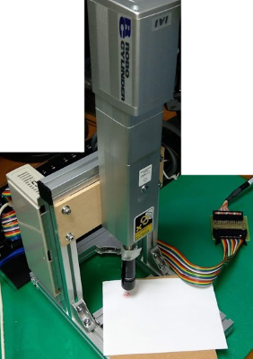
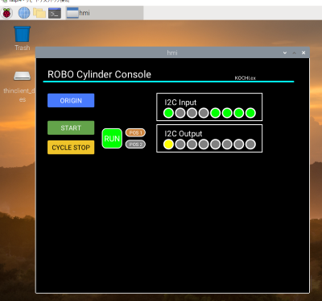
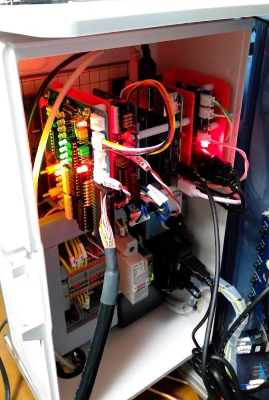

# Plcrs02

**IAIロボシリンダ制御＆ScenicでのHMI操作のテスト**


**TODO: Add description**


## 1.実行中の写真・画像

### (1)動作の流れ

 1. （原点復帰操作をする）
 1. スタートボタンを押す
 1. サーボシリンダが下がる
 1. トルク制御モードで良い感じに印鑑を押す
 1. サーボシリンダが上がって原点に戻る








<!--[動作の様子の動画](./docs/image/plcrs_sample01.mp4)
-->

## 2.設定覚え書き

### (1)起動方法

```bash
$ ./run.sh
```

PLC機能（サーボシリンダ制御、リモコン入力、シグナルタワー点灯）と、
HMI（動作状態をScenicの画面から表示）をSuperviserが起動してくれます。

### (2)I2Cエキスパンダ→ロボシリンダコントローラPCON ピンアサイン

#### X：入力

|機能|PCON|I2Cピン|
|:---:|:---:|:---:|
|完了Pos1|3B|0|
|完了Pos2|4B|1|
|完了Pos4|5B|2|
|移動中|8B|3|
|位置決め完|9B|4|
|原点復帰完|10B|5|
|運転準備完|12B|6|
|アラーム|13B|7|

#### Y：出力

|機能|PCON|I2Cピン|
|:---:|:---:|:---:|
|指令Pos1|3A|0|
|指令Pos2|4A|1|
|指令Pos4|5A|2|
|一時停止|8A|3|
|スタート|9A|4|
|原点復帰開始|10A|5|
|サーボON|11A|6|
|リセット|12A|7|

